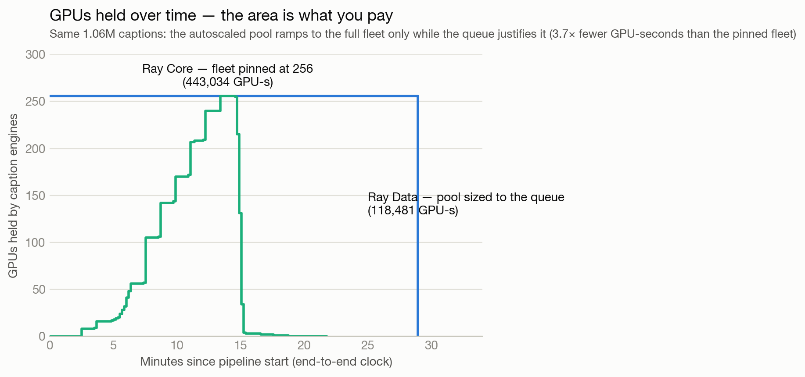

# Video captioning at scale: raw Ray Core vs Ray Data

This example captions a video corpus with a vision-language model twice — once
hand-built on [Ray Core](https://docs.ray.io/en/latest/ray-core/walkthrough.html)
and once on [Ray Data](https://docs.ray.io/en/latest/data/data.html) — so you can
compare throughput, GPU/CPU utilization, and code complexity on identical
hardware. A separate job first mirrors
[FineVideo](https://huggingface.co/datasets/HuggingFaceFV/finevideo) and
[Qwen3-VL](https://huggingface.co/Qwen/Qwen3-VL-8B-Instruct) into CoreWeave AI
Object Storage. Both captioning pipelines then read their dataset and model
from that mirror and write all durable results back to object storage.

## The stack

| Layer | Library | Role in this example |
|---|---|---|
| Orchestration (baseline) | [Ray Core](https://docs.ray.io/en/latest/ray-core/walkthrough.html) | hand-rolled tasks + actors + a manual backpressure loop |
| Orchestration (framework) | [Ray Data](https://docs.ray.io/en/latest/data/data.html) | the same DAG as a streaming pipeline with automatic backpressure |
| Inference | [vLLM](https://github.com/vllm-project/vllm) | high-throughput batched VLM inference; Run:ai streams model weights from S3 |
| Model | [Qwen3-VL](https://huggingface.co/Qwen/Qwen3-VL-8B-Instruct) | mirrored into AI Object Storage and loaded once per GPU engine |
| Dataset | [FineVideo](https://huggingface.co/datasets/HuggingFaceFV/finevideo) | mirrored into AI Object Storage and streamed by CPU readers |
| Storage | [CoreWeave AI Object Storage](https://docs.coreweave.com/products/storage/object-storage/about) | durable model, dataset, captions, reports, and mirror manifests |
| Platform | [Anyscale](https://www.anyscale.com) | image build, compute provisioning, job/service management |

## Pipeline

Both implementations run exactly the same two compute-heavy stages — defined once in
[`utils.py`](https://github.com/anyscale/ai-infra-cookbook/blob/main/video_captioning/utils.py)
— so only the orchestration differs.

```
CoreWeave AI Object Storage
    +-- datasets/finevideo/*.parquet
    +-- models/Qwen3-VL-8B-Instruct/*
    |
    +-- decode + windowed keyframe sample  # CPU: decord open, N frames per 12 s window
    |
    +-- Qwen3-VL caption                    # GPU: vLLM + Run:ai, one replica/GPU
    |
    +-- outputs/<pipeline>/<run>/            # parquet + report.json in AI storage
```

The **baseline** ([`caption_ray_core.py`](https://github.com/anyscale/ai-infra-cookbook/blob/main/video_captioning/caption_ray_core.py))
builds this out of Ray Core primitives: shard-reader/decode tasks, a pool of
GPU caption actors, and a hand-written scheduling loop that caps in-flight work
at each stage, batches decoded rows, and round-robins them across the actors.
The **rebuild** ([`caption_ray_data.py`](https://github.com/anyscale/ai-infra-cookbook/blob/main/video_captioning/caption_ray_data.py))
expresses the same DAG in a handful of Ray Data operators and gets streaming,
backpressure, fault tolerance, and autoscaling for free.

## Install the Anyscale CLI

```bash
pip install -U anyscale
anyscale login
```

## Mirror the model and dataset

Clone the example from GitHub.

```bash
git clone https://github.com/anyscale/ai-infra-cookbook.git
cd ai-infra-cookbook/video_captioning
```

[FineVideo](https://huggingface.co/datasets/HuggingFaceFV/finevideo) is gated,
so accept its terms and submit the one-time mirror job with a token:

```bash
export HF_TOKEN=hf_...

anyscale job submit -f job_mirror_to_ai_storage.yaml --env HF_TOKEN=$HF_TOKEN
```

The job resolves both Hub repositories to immutable commit SHAs, copies every
file directly into object storage, and writes `_mirror_manifest.json` plus a
`_SUCCESS` marker. It is safe to rerun: objects with the expected size are
skipped. The default layout is:

```text
$ANYSCALE_ARTIFACT_STORAGE/video_captioning/
  models/Qwen3-VL-8B-Instruct/
  datasets/finevideo/
```

Set `AI_STORAGE_ROOT=s3://<bucket>/<prefix>` on the mirror and captioning jobs
to use another explicitly authorized CoreWeave prefix.

## Submit the captioning jobs

After the mirror succeeds, run Ray Data on a small slice. No Hugging Face token
is needed by either captioning job:

```bash
anyscale job submit -f job_ray_data.yaml --env NUM_VIDEOS=500
```

Then run the raw Ray Core baseline on the same slice:

```bash
anyscale job submit -f job_ray_core.yaml --env NUM_VIDEOS=500
```

Omit `NUM_VIDEOS` to process the whole dataset. `INPUT`, `CAPTION_MODEL`, and
`OUTPUT` can override the three object prefixes, but each must be an `s3://`
URI. Scheme-less paths and shared-cluster filesystem paths are rejected. By
default, outputs land under
`$ANYSCALE_ARTIFACT_STORAGE/video_captioning/outputs/<pipeline>/<timestamp>/`.

## Understanding the example

- [`utils.py`](https://github.com/anyscale/ai-infra-cookbook/blob/main/video_captioning/utils.py)
  holds the *work*, shared by both pipelines: `decode_and_sample` does the CPU
  stage (decord open, one row of uniformly-sampled keyframes per
  `CAPTION_WINDOW_SEC` window, JPEG encode) and the message builders construct
  the Qwen3-VL prompt. At the default 12 s window, FineVideo's ~3,440
  video-hours fan out to ~1.06M captions. Because the work is identical, any
  throughput difference comes from orchestration.
- [`mirror_to_ai_storage.py`](https://github.com/anyscale/ai-infra-cookbook/blob/main/video_captioning/mirror_to_ai_storage.py)
  performs resumable, bounded-concurrency streaming copies from immutable Hub
  revisions into CoreWeave AI Object Storage without shared-storage staging.
- [`caption_ray_core.py`](https://github.com/anyscale/ai-infra-cookbook/blob/main/video_captioning/caption_ray_core.py)
  is intentionally explicit: it shows every piece of scheduling a framework
  normally hides — in-flight caps per stage, manual batching, round-robin
  dispatch, and partial-batch draining — and it hand-rolls no fault tolerance,
  so a dead actor fails the run.
- [`caption_ray_data.py`](https://github.com/anyscale/ai-infra-cookbook/blob/main/video_captioning/caption_ray_data.py)
  uses the native [`ray.data.llm`](https://docs.ray.io/en/latest/data/api/llm.html)
  vLLM integration. The read stage is pinned to `cpu_only`-labeled nodes so
  multi-MB mp4 blobs never share RAM with the GPU engines.
- Qwen3-VL-8B runs one replica per GPU with no tensor parallelism — it fits
  comfortably on a 96 GB RTX PRO 6000. vLLM's Run:ai loader streams its
  safetensors directly from the mirrored S3 prefix.

## Measuring throughput and utilization

Every run writes `report.json` next to its captions with:

- **Throughput** — captions/sec, captions/GPU/sec, and video-hours processed
  per wall-clock hour.
- **GPU-seconds held** — the integral of GPUs actually scheduled to engines
  over the timed region, and the resulting **captions per GPU-hour**. Wall
  time treats a GPU that sits idle waiting for work as free; GPU-seconds held
  is the number a shared or autoscaled cluster actually pays.
- **GPU utilization** (NVML) and **CPU utilization** (psutil), mean and p95, so
  you can see whether decode is keeping the GPUs fed or starving them.

Both timed regions are end-to-end: they start before any caption engine
exists and end when the last caption is written. That matters because the two
pipelines pay for engines very differently. The Ray Core baseline *must*
pre-provision — it creates one engine per GPU and blocks until every engine
has loaded weights before captioning anything, holding the full fleet the
whole time. Ray Data's engine pool autoscales from one replica: engines are
added only while queued work justifies them and are released as the stream
drains, so most of the fleet is never held at all.

## What a 256-GPU run shows

Both pipelines ran on identical 32-node RTX PRO 6000 clusters with both clocks
running end-to-end, at two workload sizes: one caption per clip (43.7k
captions — about two minutes of work for a warm 256-engine fleet) and dense
12 s windows (1.06M captions — a sustained deep queue). Every metric from the
1M-caption runs — including figures, time-to-completion curves, CAIOS storage
traffic, and the raw `report.json` payloads — is collected in
[BENCHMARK_1M.md](./BENCHMARK_1M.md).



| 43.7k captions (one per clip) | Ray Core | Ray Data |
|---|---|---|
| End-to-end wall time | 308 s | 726–1,041 s across runs |
| GPUs held, mean (peak) | 252 (256) | 16–22 (82) |
| GPU-seconds held | 77,599 | ~16,200 |
| **Captions per GPU-hour** | **2,028** | **~9,700 (4.8×)** |

| 1.06M captions (12 s windows) | Ray Core | Ray Data (tuned) |
|---|---|---|
| End-to-end wall time | 1,736 s | **1,125 s (1.5× faster)** |
| GPUs held, mean (peak) | 255 (256) | 105 (256) |
| GPU-seconds held | 443,034 | **118,481 (3.7× fewer)** |
| **Captions per GPU-hour** | **8,576** | **32,068 (3.7×)** |

On the short run Ray Core wins the wall clock and pays with the fleet: 256
GPUs held from the first weight load to the last caption, three-quarters of
its GPU-seconds spent on boot and drain rather than inference. On the
1M-caption run a structural limit shows up instead: every decoded row
funnels through the driver's queue, and the head-node buffer cap that keeps
that queue from OOMing also caps decode concurrency — the pinned fleet sat
at ~24% mean GPU utilization waiting on frames, and Ray Data wins outright
on both wall clock and cost.

Ray Data's autoscaled pool sizes itself to the queue: it peaked at 82 engines
when 43.7k captions couldn't keep more busy, and filled all 256 when a
million windows queued up. At both scales the same output cost a fraction of
the GPU-seconds, and the GPUs it never held are exactly what a shared or
autoscaled cluster gets back for other workloads. Three small,
measurement-driven knobs matter (all applied in
[`caption_ray_data.py`](https://github.com/anyscale/ai-infra-cookbook/blob/main/video_captioning/caption_ray_data.py)):
a pool floor `concurrency=(8, n)` so drain-tail stragglers never wait on an
engine boot, `max_concurrent_batches=8` to keep vLLM's continuous batching
fed, and a truthful `num_cpus=0.25` on the IO-bound reads so the cluster
autoscaler — which provisions against *reserved* CPUs, not utilization —
doesn't over-scale the CPU pool. [BENCHMARK_1M.md](./BENCHMARK_1M.md#efficiency-tuning-from-43-to-19-minutes)
quantifies each.

The fault-tolerance difference is not hypothetical either: one Ray Core run
died at ~6,900 captions because a single caption actor crashed and the
hand-rolled loop has no recovery — the job started over from zero. Ray Data
restarts dead workers and re-runs their blocks as part of normal execution.

## Scaling the corpus 1000×: ffmpeg augmentation + CAIOS write benchmark

[`augment_ray_data.py`](./augment_ray_data.py) /
[`job_augment_1000x.yaml`](./job_augment_1000x.yaml) turn the ~630 GiB
FineVideo mirror into a **~0.6 PB synthetic training corpus** — 1,000 distinct,
reproducible variants of every clip — while timing every PUT and GET so the
run doubles as a sustained CAIOS **write**-path benchmark under a real
workload (the complement of [`storage_bench.py`](./storage_bench.py)'s
synthetic ceilings).

Arithmetic picks the design. Re-encoding 43.7k clips × 1,000 variants is
~3.4M video-hours of x264 — around a million CPU-hours — while writing
0.6 PB needs only ~4.3 hours at the measured ~40 GiB/s PUT ceiling. So
variants come from two tiers (see [`augment_workers.py`](./augment_workers.py)):

- **Remux tier** (98% by default): keyframe-aligned temporal crop
  (`-ss`/`-t`, spans 72–98%) plus a playback-speed retime (`-itsscale`
  0.8–1.25×), stream-copied with `-c copy`. No pixels are touched, each
  variant costs ~0 CPU, and the tier runs at IO speed — this is what makes
  petabyte output feasible and what actually stresses the write path.
- **Re-encode tier** (`REENCODE_FRACTION`, default 2%): random spatial crop,
  h-flip, brightness/contrast/saturation/gamma/hue jitter, optional gaussian
  noise, and a speed change, re-encoded with libx264 at CRF 21–29. Full
  pixel-level diversity; dominates CPU cost, so this fraction is the
  wall-clock knob.

Every variant's parameters are seeded by `(video_id, variant_index)`, so the
augmented dataset is reproducible variant-by-variant. The pipeline stages
each clip once as an addressable object (`datasets/finevideo_mp4/`), fans out
`(clip, variant-range)` work items across the CPU fleet — repeated fetches of
a hot staged clip are exactly the LOTA-cache pattern that serves model
weights in the captioning benchmark — and writes one manifest row per variant
with its parameters and timings.

The write path is built to saturate, not trickle: each task hands finished
files to background uploader threads (`UPLOAD_THREADS_PER_TASK`, default 2),
so encode and PUT overlap and a 120-task node holds CAIOS's measured optimal
write concurrency (~100–150 in-flight PUTs/node) while the remux tier
produces. `report.json` carries aggregate / peak / per-node write GiB/s, PUT
latency percentiles, and a cold-vs-warm read split (each clip's first chunk
GET pulls from the backend; later chunks read LOTA's distributed cache) —
directly comparable against the saturation ceilings from
[`storage_bench.py`](./storage_bench.py): ~5 GB/s/node writes, 11–12.6
GB/s/node cold reads, 25–30 GB/s/node warm LOTA reads.

```bash
# Smoke run: 32 clips × 40 variants ≈ 12 GiB of output
anyscale job submit -f job_augment_1000x.yaml \
  --env NUM_VIDEOS=32 --env AUGMENT_FACTOR=40 --env REENCODE_FRACTION=0.1

# Full-corpus 1000× run ≈ 0.39 PB (read the quota note first)
anyscale job submit -f job_augment_1000x.yaml

# Full 0.6 PB: measured bytes-amplification is ~0.63× per variant
# (temporal crops average ~85% span and -c copy re-muxing compresses
# container overhead), so 0.6 PB needs a higher factor
anyscale job submit -f job_augment_1000x.yaml --env AUGMENT_FACTOR=1600
```

> **Quota**: CAIOS defaults to **20 TiB STANDARD per AZ per account**. A
> full-corpus run projects hundreds of TiB of output — raise the quota via
> CoreWeave support first. The driver estimates output size after staging and
> fails fast if it exceeds `OUTPUT_BUDGET_TIB`, before any transcoding starts.

Three controls matter for day-scale runs on shared capacity:

- **`TRANSCODE_CONCURRENCY`** caps concurrent transcode tasks (reserved CPUs
  = cap × `TRANSCODE_CPUS`), so the node autoscaler follows *your CPU
  budget* instead of the pool ceiling — e.g. `200` holds the run to two
  120-CPU nodes on a cluster whose remaining capacity belongs to a GPU fleet.
- **Live throughput logging**: the driver prints an `AUGMENT_PROGRESS` JSON
  line every 60 s (cumulative TiB written, windowed write/read GiB/s,
  variants/s, failures) fed by a zero-CPU stats actor, so read/write perf is
  logged while the dataset generates, not just in the final report.
- **Resume**: interrupted runs (quota, capacity, timeout) resubmit with the
  same `--output` and skip already-written chunks at the cost of one HEAD per
  chunk (`RESUME_SKIP_EXISTING=1`, default). Resumed variants count toward
  the dataset but are excluded from that run's write-throughput metrics.

The whole pipeline is CPU-only by design — remux is IO-bound, x264 is
CPU-bound, and no stage touches a GPU, so the augmentation fleet never
competes with caption/training fleets for accelerators.
[`job_storage_bench_cpu.yaml`](./job_storage_bench_cpu.yaml) is the matching
GPU-free variant of the saturation sweep (note from
[BENCHMARK_1M.md](./BENCHMARK_1M.md#first-party-measured-ceilings-us-east-14a-this-fleet):
on this fleet the fat 25–30 GiB/s LOTA path belongs to GPU nodes — CPU nodes
peak lower on warm reads, which the sweep quantifies).

### Measured (2026-07-15, Anyscale staging)

Saturation ceilings for the CPU fleet are in
[BENCHMARK_1M.md](./BENCHMARK_1M.md#cpu-only-fleet-ceilings-augmentation-fleet-2026-07-15):
**5.16 GiB/s/node writes** (41.3 GiB/s aggregate at 100 PUTs/node),
**10.6 GiB/s/node cold reads** (gateway, 500/node), ~9 GiB/s/node via LOTA.

Augmentation runs against those ceilings (both with zero failed variants):

| | Smoke (`prodjob_jm65…kaftcb`) | 5 TiB run (`prodjob_tqvj9…zskqdd`) |
|---|---|---|
| Source slice | 32 clips × 40 | 4,000 clips × 150 |
| Variants | 1,280 | **600,000** |
| Output | 12.7 GB | **5.10 TiB** (40,263 video-hours) |
| Wall (stage + transcode) | 12 s + 2.3 min | 43 s + 37.2 min |
| Write, mean / peak-30 s | 0.09 / 0.32 GiB/s | **2.34 / 4.86 GiB/s** |
| PUT p50 / p99 | 71 / 259 ms | 74 / 301 ms |
| GET per-stream, cold → warm | 33 → 30 MiB/s (1 node) | **34 → 179 MiB/s (5.3× LOTA cache)** |

Two readings worth calling out. First, the 5 TiB run landed on a 3-node
fleet (cluster capacity was held by a concurrent 256-GPU captioning run), so
its ~0.8 GiB/s/node mean draw sits well under the 5.16 GiB/s/node ceiling —
PUT p50 stayed at 74 ms, identical to the smoke run, i.e. CAIOS was loafing.
Second, measured bytes-amplification is ~0.62× per variant, so
`AUGMENT_FACTOR=1600` is the 0.6 PB setting for the full corpus (factor
1000 ≈ 0.39 PB).

### The full 0.6 PB run (2026-07-16)

[`job_augment_200nodes.yaml`](./job_augment_200nodes.yaml) ran the full
corpus at factor 1600 on 199 × 192-vCPU turin-gp workers plus a turin-gp
head (job `prodjob_gvslpm999xwhye4bzn2ec222p6` + a short heal pass):

| Metric | Value |
|---|---|
| Usable variants | **69,982,028** (99.97% of 70M; census `manifest/20260716-035918`) |
| Dataset size | **612.7 TiB — 994.9× the 630.7 GiB source** |
| Video content | 4.72M video-hours |
| Transcode wall (main run) | 4.9 h (523 TiB fresh) |
| CAIOS aggregate writes | **30.4 GiB/s mean, 50.6 GiB/s peak-30s, sustained for hours** |
| PUT p50 / p99 under saturation | 9.1 s / 18.8 s (vs 74 ms unloaded — the write path ran pinned at its ceiling) |
| Heal pass | 70M-variant HEAD sweep in ~7 min; failed chunks (~0.4%) redone; residual 0.03% |

The aggregate write ceiling grows sub-linearly with fleet width — 8 nodes
measured 41.3 GiB/s and 199 nodes ~30–50 GiB/s — so at this scale CAIOS, not
the fleet, sets the wall clock. Four scale lessons are baked into the code
and worth knowing before reproducing (each cost a run to learn):

1. `from_items()` defaults to ~200 blocks and map operators run one task per
   block — pass a real `override_num_blocks` (`CHUNKS_PER_BLOCK`) or the
   whole fleet silently caps at ~200 concurrent tasks; but one block per
   item at 437k items crushes the driver. A few chunks per block is the
   window.
2. Wide fleets need explicit demand: `request_resources()` with a few
   hundred **node-shaped** bundles at driver start. Aggregate `num_cpus=`
   and tens of thousands of 1-CPU bundles are ignored, and Ray Data's
   backpressured submission never surfaces pending demand on its own.
3. boto3 `download_file`'s 8-way multipart fan-out × 180 tasks/node ≈ 1,400
   streams/node — past the ~800/node cliff where LOTA node agents wedge.
   Single-stream `get_object` for ~15 MB objects keeps nodes in the safe
   band.
4. Every resumed run writes a full manifest census; run-stamped
   `manifest/<ts>/` subdirs keep the latest census authoritative for
   reports and downstream consumers.

## Scaling the run

The committed job YAMLs start with one GPU worker and can autoscale to 32
workers (256 GPUs). `EXPECTED_GPUS=256` makes the driver request the full fleet
from the Ray autoscaler and wait for it before starting the clock, so both
pipelines see identical hardware. Ray Core then sizes its engine fleet to that
number; Ray Data only uses it as the autoscaling pool's ceiling. For a smaller
run, set `EXPECTED_GPUS` to eight times the desired node count; the GPU pool
can scale back down to its one-node minimum when demand disappears.

## Position in the stack

**Stage:** Curate

- **Related:** [Streaming video curation with Ray Data](../video_curation/) — same video modality; that example curates, this one benchmarks captioning throughput
- **Downstream:** [SFT with Megatron-Bridge and Ray Train](../megatron_training/) — captioned clip datasets feed multimodal training
- **Journeys:** [Pretraining data factory](../README.md#journeys)

Part of the [Open-Source Frontier Infra Stack](../README.md) — explore the
map in the [interactive explorer](../README.md#interactive-explorer).
